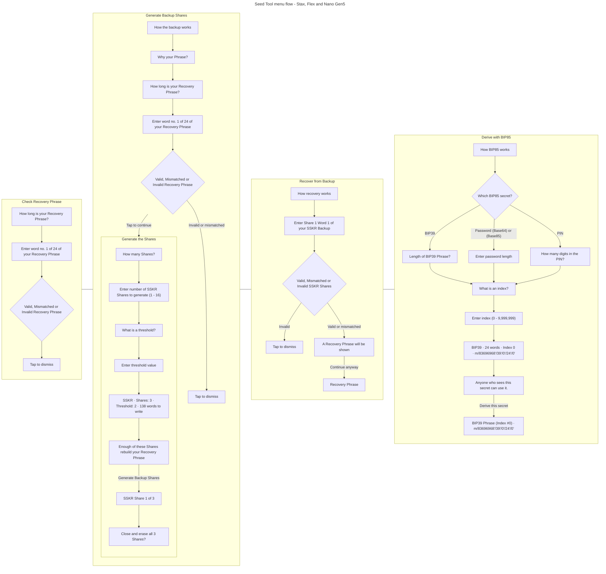
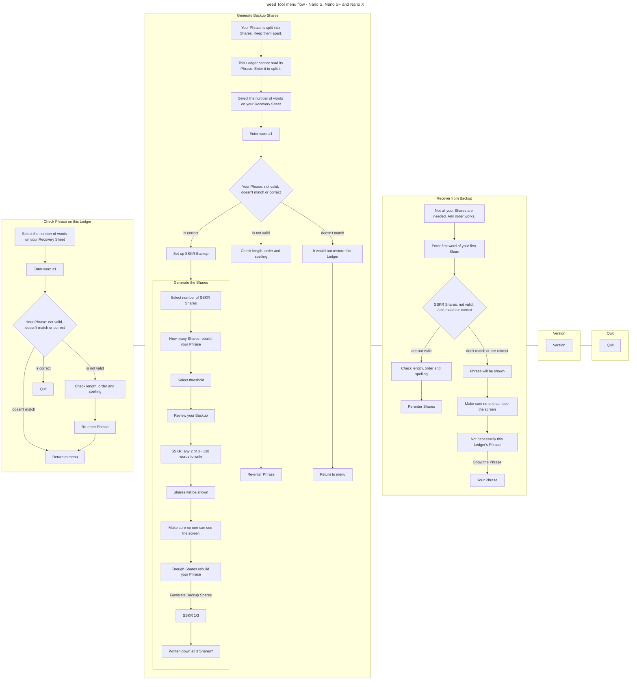
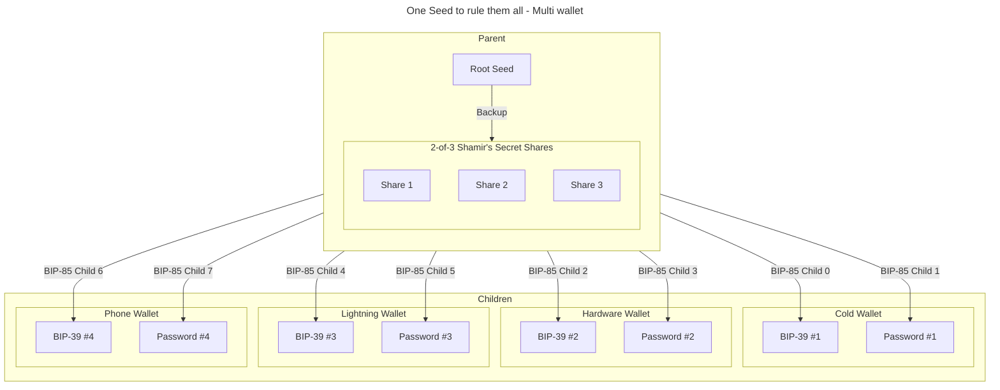
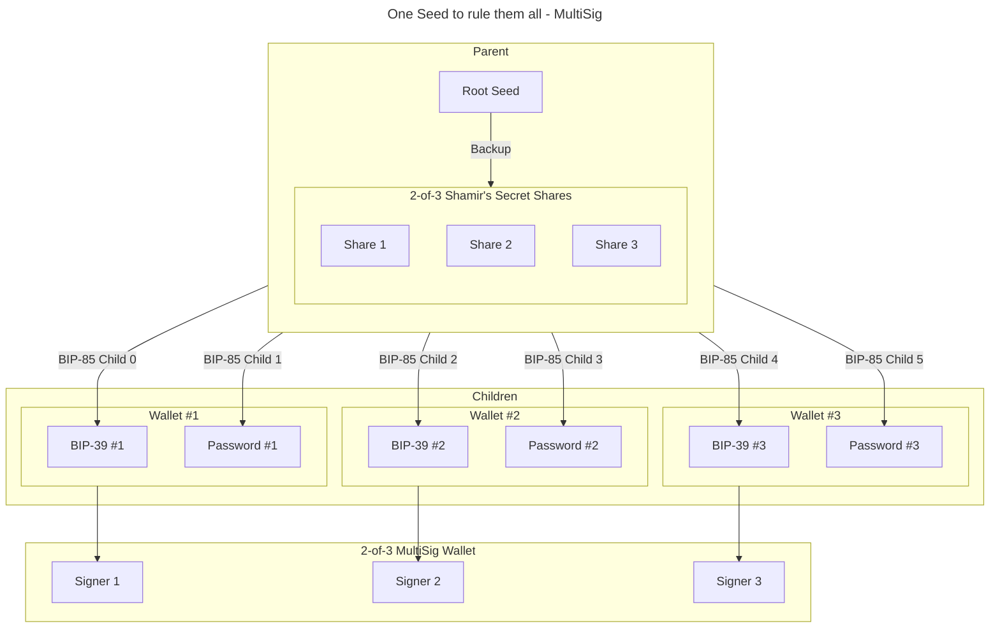

# Seed Tool: A Ledger application that provides some useful seed management utilities

---

Use the utilities provided by this Ledger application to check a backed-up [BIP-39](https://github.com/bitcoin/bips/blob/master/bip-0039.mediawiki) seed, generate [Shamir's Secret Sharing (SSS)](https://en.wikipedia.org/wiki/Shamir%27s_secret_sharing) shares for a seed, recover a [BIP-39](https://github.com/bitcoin/bips/blob/master/bip-0039.mediawiki) phrase from a Shamir's Secret Sharing backup, generate [BIP-85](https://github.com/bitcoin/bips/blob/master/bip-0085.mediawiki) children, and more.

Not all Ledger devices are equal. The older, less capable devices do not have the capacity to provide a full range of seed utilities. The following table lists the seed utilities provided by each devices type:

||Nano S|Nano S+|Nano X|Stax|Flex|Nano Gen5|
| :--- | :---: | :---: | :---: | :---: | :---: | :---: |
|[Check BIP-39](#check-bip-39)|$${\color{green}✓}$$|$${\color{green}✓}$$|$${\color{green}✓}$$|$${\color{green}✓}$$|$${\color{green}✓}$$|$${\color{green}✓}$$|
|[Check Shamir's secret shares](#check-shamirs-secret-shares)|$${\color{green}✓}$$|$${\color{green}✓}$$|$${\color{green}✓}$$|$${\color{green}✓}$$|$${\color{green}✓}$$|$${\color{green}✓}$$|
|[Generate Shamir's secret sharing](#generate-shamirs-secret-sharing)|$${\color{green}✓}$$|$${\color{green}✓}$$|$${\color{green}✓}$$|$${\color{green}✓}$$|$${\color{green}✓}$$|$${\color{green}✓}$$|
|[Recover BIP-39](#recover-bip-39)|$${\color{green}✓}$$|$${\color{green}✓}$$|$${\color{green}✓}$$|$${\color{green}✓}$$|$${\color{green}✓}$$|$${\color{green}✓}$$|
|[Generate BIP-85](#generate-bip-85)|$${\color{red}✗}$$|$${\color{orange}✓}$$|$${\color{orange}✓}$$|$${\color{green}✓}$$|$${\color{green}✓}$$|$${\color{green}✓}$$|

<table>
  <thead>
    <tr>
      <th colspan="2" align="center">Key</th>
    </tr>
  </thead>
  <tbody>
    <tr>
      <td align="center">$${\color{green}✓}$$</td>
      <td>Supported</td>
    </tr>
    <tr>
      <td align="center">$${\color{orange}✓}$$</td>
      <td>Work in progress / Planned</td>
    </tr>
    <tr>
      <td align="center">$${\color{red}✗}$$</td>
      <td>Unsupported and with no plan to support</td>
    </tr>
  </tbody>
</table>

## Application menu flow

Seed Tool draws two interfaces, and which one a device gets follows its screen rather than its age: Stax, Flex and Nano Gen5 are driven by touch, Nano S, Nano S+ and Nano X by two buttons. The two do not offer the same utilities and do not arrange them the same way, so each has its own diagram below. Every box is a screen the application draws, named with the words that screen shows; every labelled arrow is the control that carries the flow on, or the outcome that chooses between them; and the diamond is the screen whose outcome the application decides rather than the user.

### Stax, Flex and Nano Gen5

The home page carries the version, the copyright and *Quit*, and its action button opens a menu of four intentions. Those four are the flows below.

Three things the diagram does not say on its own:

* **Going back.** Every screen carries a back arrow, and going back far enough reaches the home page — which erases whatever was typed on the way there.
* **Why recovery goes on from a mismatch.** Checking and backing up stop on anything but *Valid*; recovery does not, and that is deliberate. It rebuilds the phrase whenever the shares recombine, matching this Ledger or not, because the device that needs a backup is precisely the one that no longer holds the phrase.
* **The path.** The BIP-85 derivation path is drawn twice: on the review, where the parameters are still being chosen, and again above the derived secret, so that what gets written down carries the path that reproduces it.

### Nano S, Nano S+ and Nano X

There is no home page with a menu behind it. The idle screen is a single flow walked left and right with the two buttons, and *Version* and *Quit* are steps of that flow, beside the three intentions rather than behind them. BIP-85 is absent: no Nano draws a single BIP-85 screen.

A Nano S has two lines where the others have three, so several of those sentences are shortened on it.

> [!NOTE]
> This repository also holds [demo videos](demos/README.md) and [animations](tests/functional/screenshots/README.md) of the menu flows. Both were recorded in 2024, on Nano S and Stax only, from an interface that has since been redrawn — they show the menus the two diagrams above replaced, and are kept as a record of that version rather than as a picture of this one.

## Check BIP-39
The application invites the user to type a [BIP-39](https://github.com/bitcoin/bips/blob/master/bip-0039.mediawiki) mnemonic on their Ledger device. The BIP-39 mnemonic is compared to the onboarded seed and the application notifies the user whether both seeds match or not.

## Generate Shamir's secret sharing
If the user provided seed is valid and matches the onboarded seed, the user can create [Shamir's secret sharing (SSS)](https://en.wikipedia.org/wiki/Shamir%27s_secret_sharing) from their BIP-39 phrase.
The application uses [Sharded Secret Key Reconstruction (SSKR)](https://github.com/BlockchainCommons/Research/blob/master/papers/bcr-2020-011-sskr.md), an interoperable implementation of [Shamir's Secret Sharing (SSS)](https://en.wikipedia.org/wiki/Shamir%27s_secret_sharing). This provides a way for you to divide or 'shard' the master seed underlying a Bitcoin HD wallet into 'shares', which you can then distribute to friends, family, or fiduciaries. If you lose your seed, you can reconstruct it by collecting a sufficient number of your shares (the 'threshold'). Knowledge of fewer than the required number of parts ensures that information about the master secret is not leaked.

* SSKR is round-trip compatible with BIP-39.
* SSKR is based on SLIP-39, developed by SatoshiLabs. It is an improvement on, but is incompatible with, SLIP-39.
* SSKR phrases use a dictionary of exactly 256 English words with a uniform word size of 4 letters.
* SSKR encodes a [CBOR] structure tagged with the data type [URTYPES], and is therefore self-describing.
* Phrases generated by SSKR can be up to 46 words in length i.e. 184 characters.
* Only two letters of each word (the first and last) are required to uniquely identify each byte value, making a minimal [ByteWords](https://github.com/BlockchainCommons/Research/blob/master/papers/bcr-2020-012-bytewords.md) encoding as efficient as hexadecimal (2 characters per byte) and yet less error prone.
* Additionally, words can be uniquely identified by their first three letters or last three letters.
* Minimizing the number of letters for each word simplifies transfer to permanent media such as stamped metal.

For more information about SSKR, see [SSKR for Users](https://github.com/BlockchainCommons/crypto-commons/blob/master/Docs/sskr-users.md).

### Which shares this application can read

Shares generated by this application are ordinary SSKR shares in the encoding [BCR-2020-011](https://github.com/BlockchainCommons/Research/blob/master/papers/bcr-2020-011-sskr.md) describes, and other SSKR tools read them. What the application can read *back* is narrower than what the specification allows, in three ways. All three are restrictions on recovery only: generation is unaffected.

* **One group per backup.** `SSKR_MAX_GROUP_COUNT` is 1 here, where the specification gives `group-count` four bits and the upstream [bc-sskr](https://github.com/BlockchainCommons/bc-sskr) library allows 16. A backup whose shares are spread over several groups cannot be recombined by this application — including the worked example of BCR-2020-011 itself, and any multi-group configuration produced by Gordian SeedTool. The application never generates one: both interfaces produce a single group.
* **A threshold above 10 cannot be recovered on Nano S.** `SSS_MAX_SHARE_COUNT` is 10 on Nano S and 16 on every other supported device. Recovery asks for exactly as many shares as the threshold, so a set whose *threshold* is 11 or more can be recovered on a Nano S+, Nano X, Stax, Flex or Nano Gen5 but not on a Nano S. The number of shares is not what matters: a 3-of-12 set is recoverable everywhere, since only three shares are ever entered. Generation stays inside each device's own limit — the Nano S offers 1 to 7 shares, the other devices 1 to 16.
* **CBOR tag 40309 only.** Shares carrying the superseded tag 309 (`d9 01 35`) are refused. The specification marks that version deprecated and its support optional, so refusing it is conformant, but it does mean the shares published in Blockchain Commons' own [SSKR test vectors](https://github.com/BlockchainCommons/crypto-commons/blob/master/Docs/sskr-test-vector.md) are not readable as printed.

In each case the result is that a legitimate backup is refused, not that a secret is lost — and the message the application shows does not distinguish such a refusal from a mistyped word.

> [!NOTE]
> SSKR is non-deterministic. There is a random factor introduced when the shares are created, which means that every time you generate shares they will be different. This is an expected and correct result.

> [!TIP]
> Generated Shamir's Secret Shares may be cheaply and safely backed up to a steel wallet using the methods described [here](https://blockmit.com/english/guides/diy/make-cold-wallet-washers/) or [here](https://github.com/BlockchainCommons/crypto-commons/blob/master/Docs/sskr-cold-storage.md). This will keep your backup safe in event of fire, flood or natural disaster.

## Check Shamir's secret shares
The Ledger application also provides an option to confirm the onboarded seed against SSKR shares.

## Recover BIP-39
When the Shamir's secret shares have been validated the user can recover the BIP-39 phrase derived from those shares. This option takes advantage of SSKR's ability to perform a BIP-39 <-> SSKR round trip. If a user has lost or damaged their original Ledger device they may need to recover their BIP-39 phrase on another secure device. A BIP-39 phrase may still be recovered even if the SSKR phrases do not match the onboarded seed of a device but are still valid SSKR shares.

## Generate [BIP-85](https://github.com/bitcoin/bips/blob/master/bip-0085.mediawiki)
BIP-85 is a standard built on top of [BIP-32](https://github.com/bitcoin/bips/blob/master/bip-0032.mediawiki) that enables the creation of child keys from a single parent seed. The protocol uses derivation paths to index the BIP-85 child keys. This ensures that you will always get the same child key if you follow the same derivation path from the same parent seed.

The BIP-85 standard describes several applications that use a fully hardened derivation path to create child keys supporting various formats such as BIP-39, xprv, hex, base64 passwords, base85 passwords, dice rolls and more.

> [!NOTE]
> A more detailed description of the BIP-85 standard may be found here:
> [BIP-85: Deterministic Entropy From BIP-32 Keychains](https://github.com/bitcoin/bips/blob/master/bip-0085.mediawiki)

Due to the limitations of some of the older and smaller Ledger devices, not all BIP-85 applications are supported by all devices. The following table lists the various BIP-85 applications available on different Ledger devices:

||Nano S|Nano S+|Nano X|Stax|Flex|Nano Gen5|
| :--- | :---: | :---: | :---: | :---: | :---: | :---: |
|[BIP-39](https://github.com/bitcoin/bips/blob/master/bip-0085.mediawiki#user-content-BIP-39)|$${\color{red}✗}$$|$${\color{orange}✓}$$|$${\color{orange}✓}$$|$${\color{green}✓}$$|$${\color{green}✓}$$|$${\color{green}✓}$$|
|[PWD BASE64](https://github.com/bitcoin/bips/blob/master/bip-0085.mediawiki#user-content-PWD_BASE64)|$${\color{red}✗}$$|$${\color{orange}✓}$$|$${\color{orange}✓}$$|$${\color{green}✓}$$|$${\color{green}✓}$$|$${\color{green}✓}$$|
|[PWD BASE85](https://github.com/bitcoin/bips/blob/master/bip-0085.mediawiki#user-content-PWD_BASE85)|$${\color{red}✗}$$|$${\color{orange}✓}$$|$${\color{orange}✓}$$|$${\color{green}✓}$$|$${\color{green}✓}$$|$${\color{green}✓}$$|
|[HEX](https://github.com/bitcoin/bips/blob/master/bip-0085.mediawiki#user-content-HEX)|$${\color{red}✗}$$|$${\color{orange}✓}$$|$${\color{orange}✓}$$|$${\color{orange}✓}$$|$${\color{orange}✓}$$|$${\color{orange}✓}$$|
|[DICE](https://github.com/bitcoin/bips/blob/master/bip-0085.mediawiki#user-content-DICE)|$${\color{red}✗}$$|$${\color{orange}✓}$$|$${\color{orange}✓}$$|$${\color{orange}✓}$$|$${\color{orange}✓}$$|$${\color{orange}✓}$$|

> [!TIP]
> Safely, securely and redundantly backup a parent root seed using Shamir's Secret Sharing. Use BIP-85's BIP-39 application to create several child wallets from that parent root seed. Further protect those child wallets using passwords generated using the BIP-85 PWD BASE64 or PWD BASE85 applications. On Ledger devices those wallets can also then be protected by a PIN generated using the BIP-85 DICE application.

