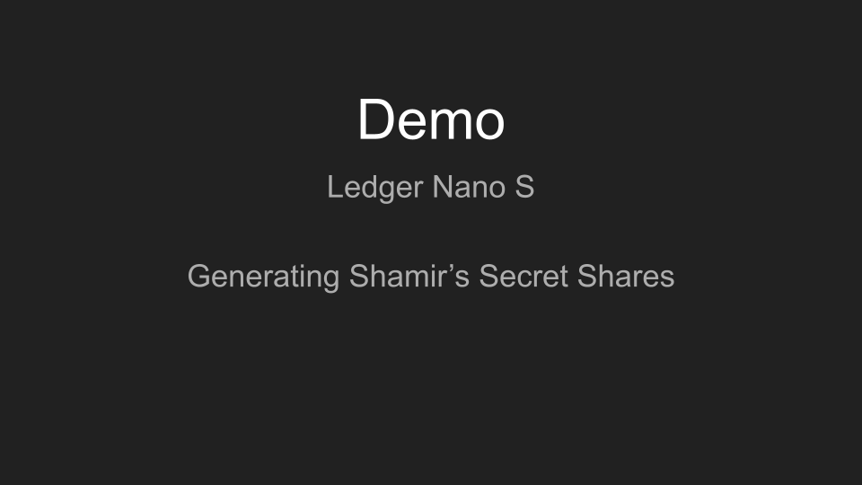
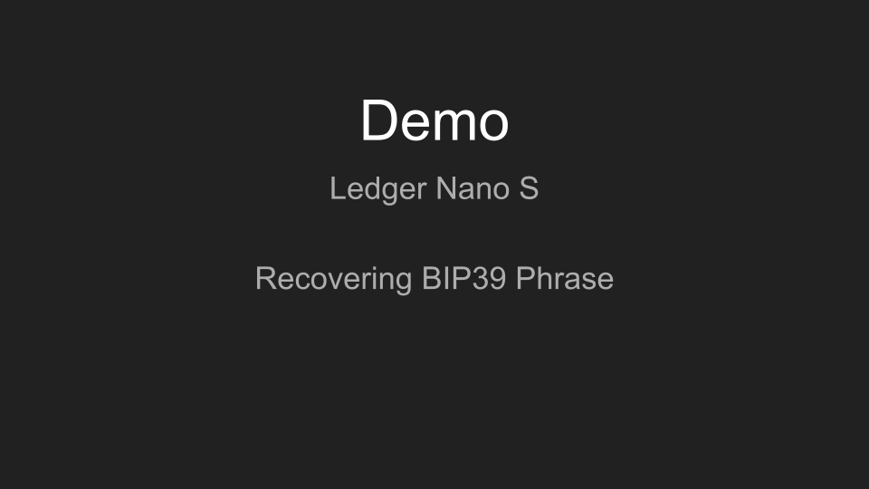
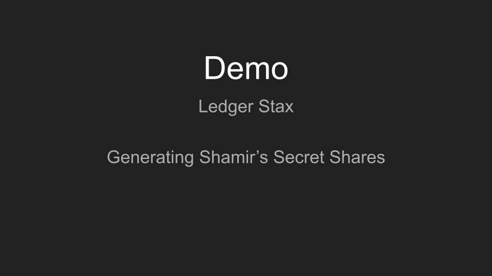
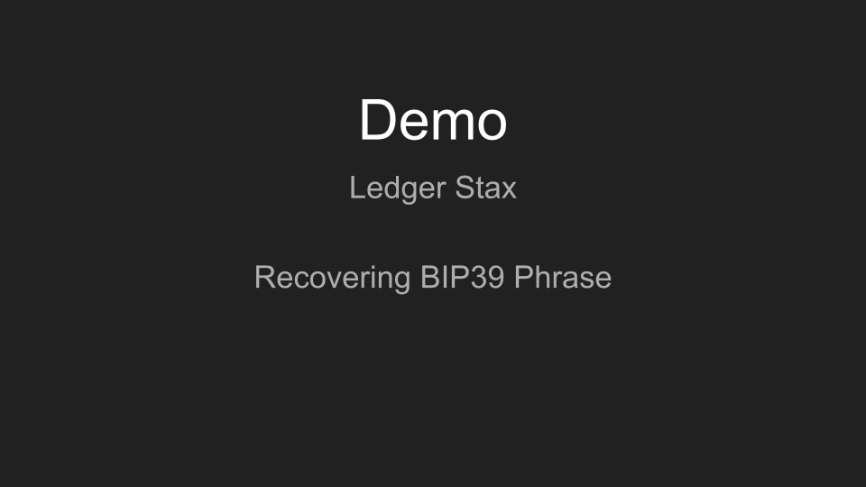

# Application menus demos

These videos were recorded in August 2024, on Nano S and Stax only, from the interface as it stood then. They are kept as a record of that version and they no longer show what the application draws: the menus they walk — *Check BIP39*, *Generate SSKR*, *Check SSKR*, *Recover BIP39* — have since been replaced by a menu of four intentions on the touch devices and a single flow of three on the Nanos. What is drawn today is in the [menu flow diagrams](/README.md#application-menu-flow).

The recordings are hosted by GitHub and cannot be remade for the current interface, which is why they are dated rather than replaced. Each thumbnail below links to its video.

## Nano S — interface of August 2024
### Check BIP39 & Generate SSKR menus

### Check SSKR & Recover BIP39 menus

## Stax — interface of August 2024
### Check BIP39 & Generate SSKR menus

### Check SSKR & Recover BIP39 menus

> [!TIP]
> Enable subtitles when viewing the videos
